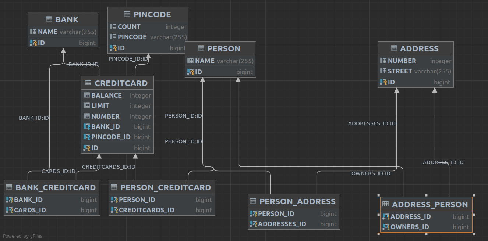

#Java JPA

Wrtiting a JPA program gave the develpoer cognitiv dificulities. The developer is used to making databases, and the communicate with the database from the app, not let the app build the database for the developer.
This made the consept of the automaticly made database a strange affair.
The implementation of the database was not to dificult.

The main issue with this assignment was the lack of control on the database. JPA is created to let developers think more about code, and less about implementation,
but the necesarity of an empty constructor baffled the developer. Further study has to be done, to see if an item factory can be implemented with the build.